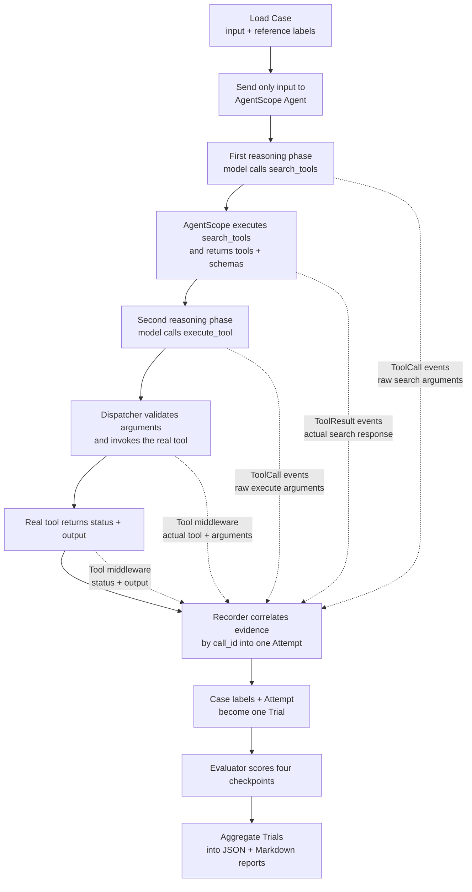

# agentscope-eval

An evaluation service for [AgentScope](https://github.com/agentscope-ai/agentscope), built on [DeepEval](https://github.com/confident-ai/deepeval).

Evaluate agent responses, tool calls, and execution results through a local API.

## Quick start

Requires Python 3.11+ and [uv](https://docs.astral.sh/uv/).

```bash
git clone https://github.com/iluv7/agentscope-eval.git
cd agentscope-eval
uv sync --locked
uv run agentscope-eval
```

Open [API documentation](http://127.0.0.1:8787/docs) to get started.

## Full AgentScope evaluation flow

Each benchmark case provides a task to the agent and keeps the reference
tool, arguments, and output private for deterministic scoring. The complete
trajectory is captured as one `Trial` and then evaluated checkpoint by
checkpoint:



The evaluator checks search-call generation, search-result quality, nested
`execute_tool` arguments, and real execution output. Scoring uses the recorded
evidence, JSON Schema validation, and exact comparisons; it does not use an
LLM judge.

## Acknowledgments

Thanks to [DeepEval](https://github.com/confident-ai/deepeval) for its evaluation tools and [AgentScope](https://github.com/agentscope-ai/agentscope) for its agent framework.
